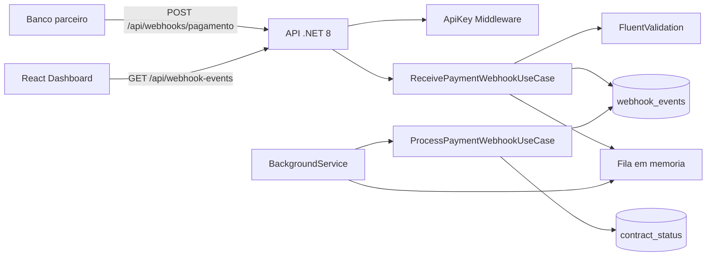
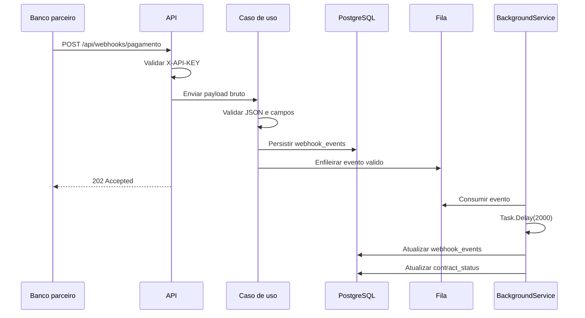
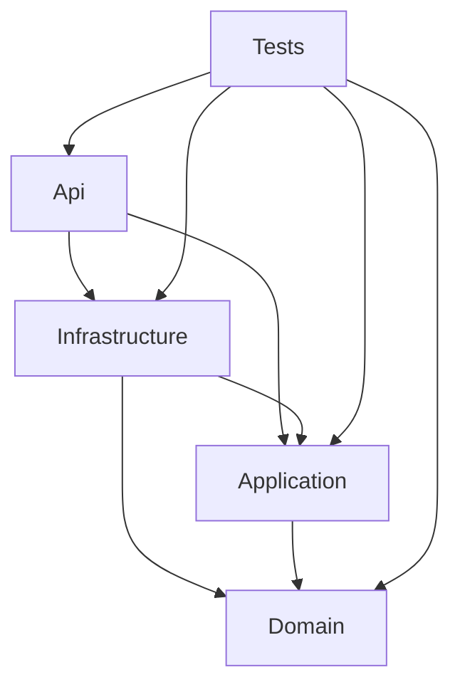

# Arquitetura

## Componentes

```mermaid
flowchart LR
    Partner[Banco parceiro] -->|POST /api/webhooks/pagamento| Api[API .NET 8]
    Api --> Auth[ApiKey Middleware]
    Api --> UseCase[ReceivePaymentWebhookUseCase]
    UseCase --> Validator[FluentValidation]
    UseCase --> Events[(webhook_events)]
    UseCase --> Queue[Fila em memoria]
    Worker[BackgroundService] --> Queue
    Worker --> Processor[ProcessPaymentWebhookUseCase]
    Processor --> Events
    Processor --> Contracts[(contract_status)]
    Dashboard[React Dashboard] -->|GET /api/webhook-events| Api
```

## Fluxo do Webhook

```mermaid
sequenceDiagram
    participant Banco as Banco parceiro
    participant API as API
    participant UC as Caso de uso
    participant DB as PostgreSQL
    participant Queue as Fila
    participant Worker as BackgroundService

    Banco->>API: POST /api/webhooks/pagamento
    API->>API: Validar X-API-KEY
    API->>UC: Enviar payload bruto
    UC->>UC: Validar JSON e campos
    UC->>DB: Persistir webhook_events
    UC->>Queue: Enfileirar evento valido
    API-->>Banco: 202 Accepted
    Worker->>Queue: Consumir evento
    Worker->>Worker: Task.Delay(2000)
    Worker->>DB: Atualizar webhook_events
    Worker->>DB: Atualizar contract_status
```

## Dependencias

```mermaid
flowchart TB
    Api --> Application
    Api --> Infrastructure
    Infrastructure --> Application
    Infrastructure --> Domain
    Application --> Domain
    Tests --> Api
    Tests --> Application
    Tests --> Domain
    Tests --> Infrastructure
```
