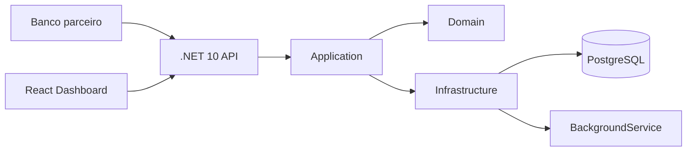

# Diagramas Mermaid

Os diagramas principais da arquitetura estao em [architecture.md](architecture.md).

## Resumo

```mermaid
flowchart LR
    Banco[Banco parceiro] --> Api[.NET 10 API]
    Api --> Application[Application]
    Application --> Domain[Domain]
    Application --> Infrastructure[Infrastructure]
    Infrastructure --> PostgreSQL[(PostgreSQL)]
    Infrastructure --> Worker[BackgroundService]
    Frontend[React Dashboard] --> Api
```
